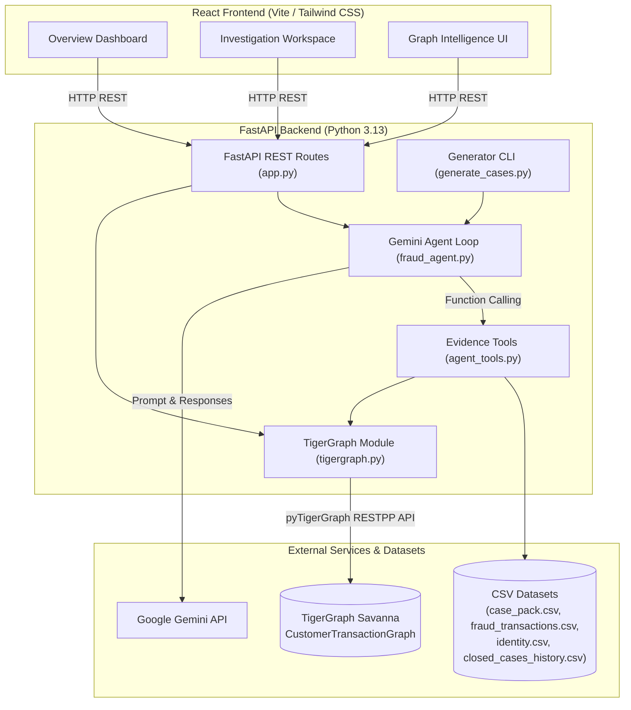

# Autonomous Fraud Investigation Agent
> **TigerGraph × Hacker House Goa 2026 Hackathon Submission**
> An AI-powered fraud investigation system combining TigerGraph graph database intelligence, Gemini native function calling, and multi-source evidence synthesis.

---

## Table of Contents
1. [Problem Statement](#1-problem-statement)
2. [Solution Overview](#2-solution-overview)
3. [Key Features](#3-key-features)
4. [Investigation Workflow](#4-investigation-workflow)
5. [Agentic AI System](#5-agentic-ai-system)
6. [TigerGraph Integration](#6-tigergraph-integration)
7. [System Architecture](#7-system-architecture)
8. [Tech Stack](#8-tech-stack)
9. [Project Structure](#9-project-structure)
10. [API Endpoints](#10-api-endpoints)
11. [Local Setup](#11-local-setup)
12. [Environment Variables](#12-environment-variables)
13. [Case Outputs](#13-case-outputs)
14. [Running an Investigation](#14-running-an-investigation)
15. [Deployment](#15-deployment)
16. [Demo Video](#16-demo-video)
17. [Technical Blog](#17-technical-blog)
18. [Security & Credentials](#18-security--credentials)
19. [Current Limitations](#19-current-limitations)
20. [Future Improvements](#20-future-improvements)
21. [Team](#21-team)

---

## 1. Problem Statement

Modern financial institutions process thousands of transaction alerts daily. Standard machine learning risk engines flag suspicious transactions with a numerical risk score (e.g., `risk_score: 0.61`), but human fraud operations teams face critical operational bottlenecks:

- **Fragmented Context**: Fraud analysts must manually cross-reference separate systems for cardholder history, transaction logs, device fingerprints, and geographic billing patterns.
- **Hidden Network Connections**: Traditional relational databases fail to easily surface multi-hop connections, such as accounts sharing the same physical device, linked payment cards, or common billing addresses.
- **Manual Synthesis Overload**: Gathering evidence, correlating historical fraud cases, and writing operational case summaries requires manual effort, increasing average handle time per investigation.

---

## 2. Solution Overview

**TigerGraphFraud** is an autonomous fraud investigation system designed to transform raw transaction alerts into structured, evidence-grounded fraud decisions.

Built for **TigerGraph × Hacker House Goa 2026**, the system uses:
- **TigerGraph Savanna** graph database for multi-hop graph relationship traversal.
- **Google Gemini** LLM with native function calling for autonomous multi-turn evidence gathering.
- **FastAPI** backend for evidence tool execution, graph queries, and REST APIs.
- **React + Vite** frontend for interactive investigation dashboards and graph intelligence visualization.

---

## 3. Key Features

- **Autonomous Tool-Calling Agent**: Leverages Gemini native tool calling (`google-genai` SDK) to select, invoke, and synthesize evidence tools based on case findings.
- **Live Graph Relationship Traversal**: Integrates directly with TigerGraph Savanna `CustomerTransactionGraph` via `pyTigerGraph` to discover linked entities, card networks, and transaction topologies.
- **Multi-Source Evidence Integration**:
  - **Transaction Details**: Amount, timestamp, channel, and model risk score.
  - **Customer Spending Baseline**: Total transaction velocity, average spending, and maximum transaction amount.
  - **Billing Region Consistency**: Historical frequency of billing region (`addr1`) usage.
  - **Device Profile Matching**: Identification of hardware signatures and device fingerprints.
  - **Historical Case Analysis**: Pattern matching against historical closed case histories (`closed_cases_history.csv`).
- **Transparent Execution Trace**: Records tool calls, safe parameters, execution status, and concise output summaries (`agent_trace`) without exposing raw internal model prompts or hidden chain-of-thought tokens.
- **Structured Assessment Payloads**: Returns standardized fraud assessments containing Recommendation (`CLEAR`, `REVIEW`, `ESCALATE`), Confidence score ($0.0 - 1.0$), Risk factors, Normal behavior signals, Graph findings, Historical findings, and Next Best Action.
- **Resumable Case Generator CLI**: CLI utility script (`generate_cases.py`) supporting targeted single-case generation, range batching, quota-safe failure stopping, non-LLM graph refreshing, and submission validation.

---

## 4. Investigation Workflow

```
Fraud Signal (risk_score alert from case_pack.csv)
      │
      ▼
Agent Investigation (Gemini LLM Agent)
      │
      ▼
Evidence Collection (CSV Data + Backend Tools)
      │
      ▼
TigerGraph Relationship Analysis (pyTigerGraph Savanna Traversal)
      │
      ▼
Historical Evidence Analysis (closed_cases_history.csv matching)
      │
      ▼
Risk Assessment (Multi-source evidence correlation)
      │
      ▼
Recommendation + Next-Best Action [CLEAR | REVIEW | ESCALATE]
```

---

## 5. Agentic AI System

The agent implementation in `backend/fraud_agent.py` uses Gemini native function calling (`ANY`/`AUTO` mode) rather than a rigid, hardcoded tool sequence.

### Available Investigation Tools

| Tool Name | Module Path | Purpose |
| :--- | :--- | :--- |
| `get_transaction_details` | `agent_tools.py` | Fetches transaction amount, channel, risk score, timestamp, and billing region. |
| `get_customer_transactions` | `agent_tools.py` | Computes customer baseline metrics (total transactions, average amount, maximum amount). |
| `check_region_history` | `agent_tools.py` | Analyzes historical frequency of the flagged transaction's billing region. |
| `check_device_identity` | `agent_tools.py` | Looks up matching device profile information and device hardware types. |
| `get_graph_evidence` | `tigergraph.py` | Queries live TigerGraph Savanna for customer & transaction node networks and edges. |
| `historical_case_analysis` | `agent_tools.py` | Matches customer ID against historical closed fraud cases and historical fraud rates. |

### Gemini Integration
The investigation agent uses Google Gemini through the `google-genai` SDK for multi-turn tool calling and evidence synthesis.

---

## 6. TigerGraph Integration

The system connects to **TigerGraph Savanna** hosting the `CustomerTransactionGraph` graph schema via `pyTigerGraph`.

### Vertex Types & Attributes

- **`Customer`**: Cardholder account vertex (`customer_id`).
- **`Transaction`**: Transaction event vertex (`transaction_amt`, `ts`, `channel`, `risk_score`).
- **`Card`**: Payment card vertex (`card_id`).
- **`DeviceProfile`**: Device fingerprint vertex (`device_info`).
- **`BillingRegion`**: Geographic billing location vertex (`addr1`).
- **`EmailDomain`**: Email domain vertex (`P_emaildomain`).
- **`FraudCase`**: Fraud case record vertex (`case_id`).

### Graph Relationships & Edges

- `(Customer) -[made_transaction]-> (Transaction)`
- `(Customer) -[Owns]-> (Card)`
- `(Transaction) -[Made]-> (Card)`
- `(Transaction) -[FROM_DEVICE]-> (DeviceProfile)`
- `(Transaction) -[BILLED_IN]-> (BillingRegion)`
- `(Transaction) -[PURCHASER_EMAIL]-> (EmailDomain)`
- `(Transaction) -[FLAGS]-> (FraudCase)`

### Graph Traversal Execution
When `get_graph_evidence(customer_id, transaction_id)` runs, the backend queries TigerGraph Savanna to fetch the target `Customer` and `Transaction` vertices, along with connected transaction nodes and `made_transaction` edges. The resulting graph payload provides real node structures, edge mappings, and human-readable graph finding summaries for the AI agent and frontend graph visualization.

---

## 7. System Architecture



---

## 8. Tech Stack

- **Frontend**: React 19, TypeScript, Vite, Tailwind CSS v4, Lucide React, Recharts
- **Backend**: Python 3.13, FastAPI, Uvicorn, Pandas, Pydantic, `python-dotenv`
- **AI / Agent**: Google GenAI SDK (`google-genai`), Gemini 3.6 Flash / 3.5 Flash (Native Function Calling)
- **Graph Database**: TigerGraph Savanna 4.2.5 (`CustomerTransactionGraph`), `pyTigerGraph` 2.0.4
- **Datasets**: 20 Hackathon Fraud Cases (`case_pack.csv`), 26,600+ Transactions (`graph_transactions.csv`), Identity Fingerprints (`identity.csv`), Historical Cases (`closed_cases_history.csv`)
- **Deployment**: Render (FastAPI Backend & React Frontend)

---

## 9. Project Structure

```
TigerGraphFraud/
├── backend/
│   ├── .env                    # Environment variables (gitignored)
│   ├── app.py                  # FastAPI server & endpoints
│   ├── agent_tools.py          # Evidence retrieval functions
│   ├── fraud_agent.py          # Gemini AI agent & multi-turn loop
│   ├── tigergraph.py           # pyTigerGraph connection & traversal
│   ├── generate_cases.py       # CLI submission output generator & validator
│   ├── load_all_graph_data.py  # TigerGraph dataset batch loading script
│   ├── test_tigergraph.py      # TigerGraph connection test script
│   └── requirements.txt        # Backend dependencies
├── frontend/
│   ├── src/
│   │   ├── components/         # React components (Sidebar, GraphView, etc.)
│   │   ├── pages/              # Overview, Cases, Investigation, Graph Intelligence
│   │   ├── services/           # Frontend API client (api.ts)
│   │   ├── App.tsx             # React main application router
│   │   └── main.tsx            # React entry point
│   ├── package.json            # Frontend Node.js dependencies
│   └── vite.config.ts          # Vite build config
├── cases/                      # Root directory for 20 hackathon JSON outputs
│   ├── HHG-001.json
│   ├── HHG-002.json
│   └── ... (HHG-003 to HHG-020)
├── data/                       # CSV datasets
│   ├── case_pack.csv           # 20 fraud cases (HHG-001 to HHG-020)
│   ├── graph_transactions.csv  # 26,643 customer transactions
│   ├── identity.csv            # Device profile mappings
│   └── closed_cases_history.csv# Historical fraud case history
├── docs/                       # Project documentation assets
├── Tigergraph/                 # TigerGraph GSQL schema and query definitions
└── README.md                   # Root project documentation
```

---

## 10. API Endpoints

The FastAPI server (`backend/app.py`) provides the following REST endpoints:

- `GET /api/health`
  - Returns backend operational status, dataset availability, Gemini agent connection status, and TigerGraph Savanna connection status.
- `GET /api/cases`
  - Returns the list of all 20 fraud cases from `case_pack.csv`.
- `GET /api/cases/{case_id}`
  - Returns case metadata for a specific case ID.
- `POST /api/investigate/{case_id}`
  - Triggers the complete investigation pipeline: gathers evidence, executes live TigerGraph traversal, invokes the Gemini agent, and returns the unified JSON response.
- `POST /api/graphrag/query`
  - Executes live multi-hop graph retrieval from TigerGraph Savanna (`Customer -> Transaction -> Card/Device/Region/FraudCase`), formats structured context, and runs Gemini GraphRAG synthesis.

---

## 10b. GraphRAG & TigerGraph MCP Integration

### 1. GraphRAG Engine (`backend/graphrag.py`)
- **Multi-hop Graph Traversal**: Expands up to 2 hops starting from `Customer` and `Transaction` root nodes in TigerGraph Savanna.
- **Context Synthesis**: Formats topological graph node and edge paths into structured context for Gemini LLM synthesis.
- **Standalone API**: Exposed via `POST /api/graphrag/query` and verified with `python backend/test_graphrag.py`.

### 2. TigerGraph Model Context Protocol (MCP) Server (`backend/mcp_server.py`)
- **Standardized MCP Interface**: Implements JSON-RPC 2.0 protocol (`tools/list` and `tools/call`) exposing TigerGraph tools for AI agent invocation.
- **Exposed Tools**: `get_graph_evidence` and `execute_graphrag_retrieval`.
- **Verification**: Tested end-to-end via `python backend/test_mcp.py`.


---

## 11. Local Setup

### Prerequisites
- Python 3.10+ (Python 3.13 recommended)
- Node.js 18+ and npm
- Active TigerGraph Savanna instance with `CustomerTransactionGraph` loaded
- Google Gemini API Key

### 1. Clone Repository
```bash
git clone https://github.com/prachisj4/TigerGraphFraud.git
cd TigerGraphFraud
```

### 2. Backend Setup
```bash
cd backend
python -m venv venv

# Windows PowerShell:
.\venv\Scripts\Activate.ps1
# Linux/macOS:
source venv/bin/activate

pip install -r requirements.txt
```

### 3. Frontend Setup
```bash
cd ../frontend
npm install
```

### 4. Running Local Development Servers
- **Start FastAPI Backend**:
  ```bash
  cd backend
  uvicorn app:app --port 8001 --reload
  ```
- **Start React Frontend**:
  ```bash
  cd frontend
  npm run dev
  ```
- Open `http://localhost:5173` in your web browser.

---

## 12. Environment Variables

Create `backend/.env` with private credentials (**do NOT commit this file**):

```ini
# backend/.env
GEMINI_API_KEY=your_gemini_api_key
TIGERGRAPH_HOST=your_tigergraph_host
TIGERGRAPH_SECRET=your_tigergraph_secret
FRONTEND_URL=your_frontend_url
```

Create `frontend/.env` (optional for local development):

```ini
# frontend/.env
VITE_API_URL=http://localhost:8001
```

---

## 13. Case Outputs

The root `cases/` directory stores submission JSON investigation outputs for all 20 cases (`HHG-001.json` through `HHG-020.json`).

### JSON Output Structure

```json
{
  "case": {
    "case_id": "HHG-001",
    "opened_at": "2016-12-05 01:55:28",
    "trigger_type": "risk_score",
    "trigger_text": "Real-time model scored transaction 3514030...",
    "flagged_txn_id": "3514030",
    "card_id": "C12382-K1",
    "customer_id": "C12382",
    "risk_score": 0.61
  },
  "transaction": { ... },
  "customer_behavior": { ... },
  "region_history": { ... },
  "device_identity": { ... },
  "graph_evidence": {
    "status": "completed",
    "summary": { "total_nodes": 10, "total_edges": 9 },
    "nodes": [ ... ],
    "edges": [ ... ],
    "findings": [ "Customer C12382 is connected via 'made_transaction' to Flagged Transaction 3514030 in TigerGraph." ]
  },
  "historical_case_analysis": { ... },
  "agent_trace": [ ... ],
  "agent_assessment": {
    "recommendation": "REVIEW",
    "confidence": 0.85,
    "summary": "...",
    "risk_factors": [ ... ],
    "supporting_evidence": [ ... ],
    "contradicting_evidence": [ ... ],
    "graph_findings": [ ... ],
    "historical_findings": [ ... ],
    "suggested_action": "Manually verify cardholder identity...",
    "limitations": [ ... ],
    "tools_used": [ ... ]
  }
}
```

### CLI Generator Commands (`generate_cases.py`)

```bash
# Generate a specific case
python backend/generate_cases.py --case HHG-001

# Generate a range of cases (e.g. 1 to 5)
python backend/generate_cases.py --start 1 --end 5

# Force overwrite existing cases
python backend/generate_cases.py --case HHG-001 --force

# Perform Non-LLM live TigerGraph evidence refresh
python backend/generate_cases.py --refresh-graph

# Run validation across all 20 case files
python backend/generate_cases.py --validate
```

---

## 14. Running an Investigation

1. Launch backend (`uvicorn app:app --port 8001`) and frontend (`npm run dev`).
2. Navigate to **Cases** or **Investigation Workspace**.
3. Select any case (e.g., `HHG-001`).
4. Click **Run Investigation** to initiate evidence gathering, TigerGraph traversal, and Gemini assessment.
5. Inspect real-time agent tool trace steps, TigerGraph graph nodes and edges in **Graph Intelligence**, and the final Next Best Action decision.

---

## 15. Deployment

The application is deployed on Render:

- **Frontend Web Application**: [https://tigergraphfraud-frontend.onrender.com](https://tigergraphfraud-frontend.onrender.com)
- **FastAPI Backend API**: [https://tigergraphfraud.onrender.com](https://tigergraphfraud.onrender.com)
- **Graph Database**: TigerGraph Savanna Cloud (`CustomerTransactionGraph`)

---

## 16. Demo Video

- **Demo Video Link**: [ADD LINK]

---

## 17. Technical Blog

- **Technical Article Link**: [ADD LINK]

---

## 18. Security & Credentials

- API keys, secrets, and database credentials are kept strictly in `backend/.env` and excluded from Git via `.gitignore`.
- The dataset output generator script (`generate_cases.py`) contains a recursive sanitization filter (`sanitize_data`) that strips secret keys (`TIGERGRAPH_SECRET`, `GEMINI_API_KEY`, auth tokens, bearer headers) before writing output files.

---

## 19. Current Limitations

- **API Rate Limits**: Investigation generation is subject to Gemini API rate and usage quotas.
- **Read-Only Traversals**: The system currently executes graph read queries and traversals; automated graph write-backs or real-time vertex mutations during runtime investigations are not performed.
- **Anonymized Customer Identifiers**: Customer records utilize synthetic identifiers (`C12382`) without personal identifiable information (PII).

---

## 20. Future Improvements

- **Automated Real-Time Graph Write-Back**: Persist confirmed fraud findings directly into TigerGraph Savanna vertices.
- **Advanced GSQL Graph Algorithms**: Run PageRank, Louvain community detection, and shortest path algorithms for advanced fraud ring detection.
- **Suspicious Activity Report (SAR) Export**: Automatically generate standardized SAR export documents for escalated cases.
- **Multi-Agent Collaboration**: Deploy specialized parallel sub-agents (e.g., Graph Specialist, Device Analyst, Compliance Officer).

---

## 21. Team

- **Hackathon**: TigerGraph × Hacker House Goa 2026
- **Task**: TigerGraph Partner Challenge Task 1
- **Team Members**: [ADD LINK / PLACEHOLDER]
