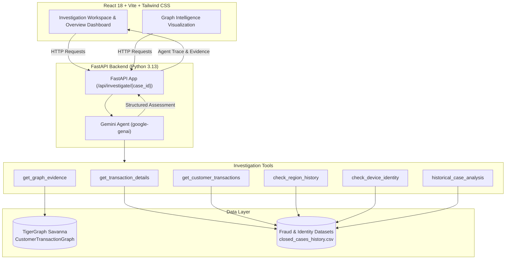
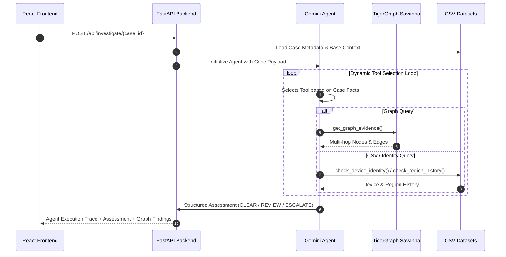

# TigerGraphFraud — Autonomous AI & Graph Fraud Investigator

> **Next-Generation Fraud Investigation Platform powered by Google Gemini Agentic AI, TigerGraph Savanna, and Multi-Hop Relationship Intelligence.**

---

## 📌 Problem

Traditional rule-based fraud detection systems rely on isolated transaction parameters (amount, time, category) and fail when investigating complex fraud patterns. Fraudsters split transactions across synthetic identities, compromised cards, and shared device fingerprints across multiple accounts. Rule engines lack context, flooding analysts with high false-positive alerts while missing hidden multi-hop fraud rings.

---

## 💡 Solution

**TigerGraphFraud** combines **Google Gemini 3.5/3.6 Agentic AI** with **TigerGraph Savanna Graph Intelligence** to create an autonomous fraud investigation platform.

When a suspicious transaction triggers an alert, the Gemini AI Agent dynamically selects and executes investigation tools—retrieving customer baseline behavior, inspecting device fingerprints, querying TigerGraph for shared entity relationships, and comparing past closed case outcomes—synthesizing empirical evidence into structured **CLEAR**, **REVIEW**, or **ESCALATE** operational recommendations.

---

## ✨ Key Features

- **Autonomous Gemini AI Agent**: Uses `google-genai` SDK with native tool calling to dynamically investigate cases.
- **TigerGraph Savanna Integration**: Explores graph relationships across cards, devices, billing regions, and email domains using `pyTigerGraph`.
- **Observable Execution Trace**: Real-time step-by-step audit log of tool execution activity without exposing private LLM chain-of-thought.
- **6 Investigation Tools**:
  1. `get_transaction_details`: Retrieves exact transaction parameters.
  2. `get_customer_transactions`: Computes customer baseline transaction velocity.
  3. `check_region_history`: Verifies customer billing region history.
  4. `check_device_identity`: Inspects device types and browser user-agent fingerprints.
  5. `get_graph_evidence`: Queries TigerGraph for multi-hop graph entity connections.
  6. `historical_case_analysis`: Searches 5,500+ closed historical cases for pattern outcomes.
- **Structured Assessment**: Standardized assessment returns `CLEAR`, `REVIEW`, or `ESCALATE` recommendations with confidence metrics, risk factors, supporting evidence, and suggested operational actions.
- **20 Real Investigation Cases**: Pre-loaded test suite (`HHG-001` through `HHG-020`) derived from real fraud datasets.

---

## 🏗️ Architecture Diagram



---

## 🔄 Agentic Workflow



---

## 🌐 TigerGraph Graph Entities

The `CustomerTransactionGraph` schema hosted on TigerGraph Savanna models relationships across 7 core entity types:

- **Customer**: Unique customer profiles (`customer_id`).
- **Transaction**: Individual payment transactions (`TransactionID`, `TransactionAmt`).
- **Card**: Credit/debit card entities (`card_id`).
- **DeviceProfile**: Device user agent & device info (`DeviceInfo`, `DeviceType`).
- **BillingRegion**: Geographic billing region codes (`addr1`).
- **EmailDomain**: Customer email domain extensions.
- **FraudCase**: Historical closed fraud cases.

---

## 🛠️ Tech Stack

- **Frontend**: React 18, Vite, TypeScript, Tailwind CSS, Lucide Icons
- **Backend**: Python 3.13, FastAPI, Uvicorn, Pandas, `python-dotenv`
- **AI / LLM**: Google Gemini 3.5/3.6 Flash (`google-genai` Python SDK with native function calling)
- **Graph Database**: TigerGraph Savanna (4.2.5), `pyTigerGraph` (2.0.4)

---

## 📂 Project Structure

```
TigerGraphFraud/
├── backend/
│   ├── app.py                     # FastAPI application endpoints
│   ├── fraud_agent.py             # Gemini Agentic loop & tool calling logic
│   ├── agent_tools.py             # 5 CSV-based investigation tools
│   ├── tigergraph.py              # pyTigerGraph connection & graph evidence query tool
│   ├── test_gemini.py             # Gemini API connectivity test script
│   ├── test_tigergraph.py         # TigerGraph Savanna test script
│   ├── test_all_cases.py          # 20-case verification runner
│   ├── .env.example               # Environment variables template
│   └── requirements.txt           # Python dependencies
├── frontend/
│   ├── src/
│   │   ├── components/            # React UI components (GraphView, CaseTable, etc.)
│   │   ├── pages/                 # Pages (Overview, Cases, Investigation, GraphIntelligence)
│   │   ├── services/api.ts        # Frontend API client
│   │   └── data/                  # Local fallback datasets
├── data/                          # CSV Datasets (fraud_transactions, case_pack, etc.)
├── docs/                          # Project Documentation & Demo Script
│   └── DEMO.md                    # Hackathon Demo Guide
├── .gitignore                     # Git ignore rules
└── README.md                      # Platform documentation
```

---

## ⚡ Setup & Environment Configuration

### 1. Clone & Configure Backend Environment

Copy `.env.example` to `backend/.env`:

```bash
cp backend/.env.example backend/.env
```

Edit `backend/.env` with your real API credentials:

```env
GEMINI_API_KEY=your_gemini_api_key
TIGERGRAPH_SECRET=your_tigergraph_secret
TIGERGRAPH_HOST=https://your-workspace-id.i.tgcloud.io:443
```

### 2. Install Backend Dependencies

```bash
cd backend
pip install -r requirements.txt
```

---

## 🚀 Running the Application

### 1. Start FastAPI Backend Server

```bash
cd backend
python -m uvicorn app:app --host 127.0.0.1 --port 8000
```

Verify backend health at `http://127.0.0.1:8000/api/health`.

### 2. Start React Frontend

```bash
cd frontend
npm install
npm run dev
```

Open `http://localhost:5173` in your browser.

---

## 📡 API Endpoints

- `GET /api/health`: System health check returning status of backend, dataset, Gemini agent, and TigerGraph connection.
- `GET /api/cases`: Retrieves list of all 20 fraud cases.
- `GET /api/cases/{case_id}`: Retrieves details for a single fraud case.
- `POST /api/investigate/{case_id}`: Runs an autonomous Gemini agent investigation on a case and returns evidence findings, agent trace, and structured assessment.

---

## ✅ Verified Technical Validation Results

| Metric | Verified Result |
| :--- | :--- |
| **Total Cases Tested** | **20 / 20** |
| **Successful Agent Investigations** | **20 / 20 (100%)** |
| **Customer Graph Coverage** | **20 / 20 (100%)** |
| **Flagged Txn Graph Coverage** | **20 / 20 (100%)** |
| **Graph Evidence Query Success** | **20 / 20 (100%)** |
| **Models Used** | `gemini-3.5-flash-lite`, `gemini-3.1-flash-lite` |

---

## 🔒 Security & Privacy

- **Server-Side Credentials**: `GEMINI_API_KEY` and `TIGERGRAPH_SECRET` are strictly kept server-side in `backend/.env` and are never exposed to the frontend or git repositories.
- **Trace Safety**: Private model chain-of-thought, system prompts, and internal reasoning tokens are excluded from `agent_trace`. Only public tool execution activity is exposed.

---

## ☁️ Production Deployment Guide

### Backend Deployment (Render)

1. **Root Directory**: `backend`
2. **Build Command**: `pip install -r requirements.txt`
3. **Start Command**: `uvicorn app:app --host 0.0.0.0 --port $PORT`
4. **Environment Variables**:
   - `GEMINI_API_KEY`: Your Gemini API Key
   - `TIGERGRAPH_HOST`: `https://<workspace-id>.i.tgcloud.io:443`
   - `TIGERGRAPH_SECRET`: Your TigerGraph Savanna Database Secret
   - `FRONTEND_URL`: Your deployed Vercel frontend URL (e.g., `https://your-app.vercel.app`)

### Frontend Deployment (Vercel)

1. **Root Directory**: `frontend`
2. **Build Command**: `npm run build`
3. **Output Directory**: `dist`
4. **Environment Variables**:
   - `VITE_API_BASE_URL`: `https://your-backend.onrender.com/api`
5. **SPA Rewrites**: Handled automatically via `frontend/vercel.json`.

